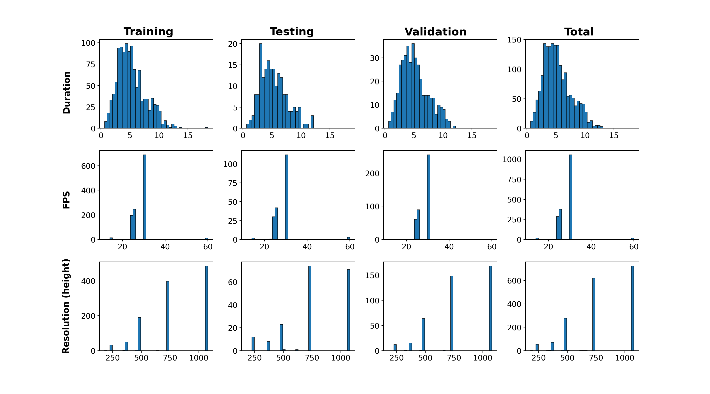
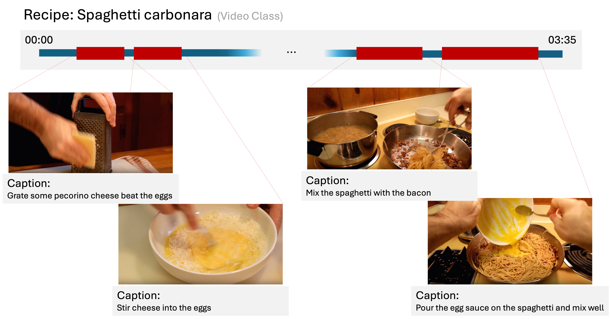

# LongVideo-Dataset

This repository provides an **overview of the long video datasets** used in our project.  
The goal is not to provide download or implementation details, but to **clarify the structure, properties, and annotations** of each dataset

---

## 1. LVU-movieclips
- [Hompage Link](https://chaoyuan.org/lvu/)
- [Paper](chrome-extension://efaidnbmnnnibpcajpcglclefindmkaj/https://openaccess.thecvf.com/content/CVPR2021/papers/Wu_Towards_Long-Form_Video_Understanding_CVPR_2021_paper.pdf?) - CVPR 2021
- **Domain & Task**: Movie clips from diverse genres; designed for *Video QA, Emotion Recognition, and Scene Understanding*.  
- **Scale & Length**: ~62,000 clips from 1,000+ movies; average clip ~2 minutes.  
- **Annotation Granularity**:  
  - Scene-level labels (emotion, action, objects).  
  - Question-Answer (QA) pairs for reasoning.  
- **Modalities**: Video, Audio, Text (subtitles, QA).  
- **Key Challenges**: Diverse content across genres; multi-event structure within each clip.  
- **Visualization Ideas**:  
  - Genre distribution pie chart.  
  - Example clip timeline with event/QA annotation.

---

## 2. ActivityNet
- [Homepage Link](http://activity-net.org/download.html)
- [Paper](https://openaccess.thecvf.com/content_cvpr_2015/html/Heilbron_ActivityNet_A_Large-Scale_2015_CVPR_paper.html?) - CVPR 2015
- **Domain & Task**: Untrimmed web videos; widely used for *Temporal Action Localization* and *Activity Recognition*.  
- **Scale & Length**: ~20,000 videos (~648 hours total); average length ~2 minutes (30s ~ 10min).  
- **Annotation Granularity**: Temporal segments with activity labels (`start_time`, `end_time`, `label`).  
- **Modalities**: Video, Audio.  
- **Key Challenges**: Actions appear sparsely within long videos; significant background content.  
- **Visualization Ideas**:  
  - Histogram of video length distribution.  
  - Example timeline with detected actions vs background.

---

## 3. YouCook2

### Split statistics
| split      | n_videos | total_minutes | avg_minutes_per_video |
|:-----------|---------:|--------------:|----------------------:|
| testing    |      190 |       1005.76 |                  5.29 |
| training   |     1161 |       6139.07 |                  5.29 |
| validation |      410 |       2132.85 |                  5.20 |
| **total**  |   **1761** |     **9277.67** |               **5.27** |

- [Huggingface Link](https://huggingface.co/datasets/lmms-lab/YouCook2)
- [Paper](https://ojs.aaai.org/index.php/AAAI/article/view/12342?) - AAAI 2018
- **Domain & Task**: Cooking instructional videos; mainly used for *Video Captioning* and *Instructional Understanding*.  
- **Duration, FPS, Resolutions**:

  

- **Annotation Granularity**: Segment-level cooking steps with captions.  

  

- **Modalities**: Video, Audio, Text (captions).  
- **Key Challenges**: Long dependencies between sequential steps; fine-grained reasoning required.  
---

## 4. FineVideo
- [Huggingface Link](https://huggingface.co/datasets/HuggingFaceFV/finevideo?)
- [Homepage Link](https://github.com/huggingface/fineVideo) - No Conference 2024
- **Domain & Task**: Multi-domain (sports, instructional, daily activities); designed for *Fine-grained and Hierarchical Video Understanding*.  
- **Scale & Length**: ~1,500 videos (~400 hours); average ~15 minutes.  
- **Annotation Granularity**: Hierarchical labels — coarse actions → fine-grained sub-actions.  
- **Modalities**: Video, Audio.  
- **Key Challenges**: Very long videos (10min+); hierarchical reasoning required across levels.  
- **Visualization Ideas**:  
  - Tree diagram showing hierarchical labels.  
  - Timeline plot highlighting coarse vs fine-grained events.

---

## 5. COIN
- [Homepage Link](https://coin-dataset.github.io/)
- [Paper](chrome-extension://efaidnbmnnnibpcajpcglclefindmkaj/https://openaccess.thecvf.com/content_CVPR_2019/papers/Tang_COIN_A_Large-Scale_Dataset_for_Comprehensive_Instructional_Video_Analysis_CVPR_2019_paper.pdf) - CVPR 2019
- **Domain & Task**: Instructional videos across 180 daily tasks (e.g., DIY, repair, cooking); used for *Step Segmentation* and *Instructional Representation Learning*.  
- **Scale & Length**: ~11,827 videos (~476 hours); average ~2.5 minutes.  
- **Annotation Granularity**:  
  - Task-level → step-level segmentation.  
  - Step-by-step textual descriptions.  
- **Modalities**: Video, Audio, Text (step descriptions).  
- **Key Challenges**: Multi-step reasoning; alignment between task and step structure.  
- **Visualization Ideas**:  
  - Histogram of steps per task.  
  - Example video timeline with step segmentation.

---

## 6. BREAKFAST
- [Homepage Link](https://serre-lab.clps.brown.edu/resource/breakfast-actions-dataset/)
- [Paper](chrome-extension://efaidnbmnnnibpcajpcglclefindmkaj/https://openaccess.thecvf.com/content_cvpr_2014/papers/Kuehne_The_Language_of_2014_CVPR_paper.pdf) - CVPR 2014
- **Domain & Task**: Daily cooking and morning activity videos; used for *Fine-grained Action Segmentation* and *Sequential Modeling*.  
- **Scale & Length**: ~1,712 videos (~77 hours); average 2–5 minutes.  
- **Annotation Granularity**: Frame-level labels for atomic actions; ordered activity sequences (e.g., “take cup → pour coffee → stir”).  
- **Modalities**: Video, Audio.  
- **Key Challenges**: Fine-grained sequential dependencies; high intra-class variation.  
- **Visualization Ideas**:  
  - Class frequency bar chart (e.g., “take cup” vs “pour milk”).  
  - Example annotated frame sequence illustrating step order.

---

# 📊 Comparison Table

| Dataset        | Domain         | #Videos | Hours | Avg Length | Annotation Level        | Modalities       |
|----------------|----------------|---------|-------|------------|-------------------------|-----------------|
| LVU-movieclips | Movies         | 62k     | -     | ~2 min     | Scene + QA              | V, A, T         |
| ActivityNet    | Web videos     | 20k     | 648h  | ~2 min     | Temporal action         | V, A            |
| YouCook2       | Cooking        | 1.7k      | 155h  | 5.3 min   | Segment + Captions      | V, A, T         |
| FineVideo      | Multi-domain   | 1.5k    | 400h  | 15 min     | Hierarchical labels     | V, A            |
| COIN           | Instructional  | 11.8k   | 476h  | 2.5 min    | Task → Step segmentation| V, A, T         |
| BREAKFAST      | Daily activity | 1.7k    | 77h   | 2–5 min    | Frame-level + Sequence  | V, A            |

---

---
# SOTA Table
### 🔧 Representation-Learning view 

| Dataset        | Rep-learning angle                               | Strong backbone(s) seen in SOTA papers | Links |
|----------------|---------------------------------------------------|----------------------------------------|-------|
| LVU-movieclips | Long-context classification & metadata inference | ViS4mer                                 | [Paper](https://arxiv.org/abs/2204.01692) |
| ActivityNet    | Recognition / TAL features                        | InternVideo2-6B; E2E-TAD (1B)           | [InternVideo2](https://arxiv.org/abs/2403.15377) · [E2E-TAD CVPR’24](https://openaccess.thecvf.com/content/CVPR2024/papers/Zhu_End-to-End_One-Billion-Parameter_Model_for_Temporal_Action_Detection_CVPR_2024_paper.pdf) |
| YouCook2       | Dense VC / step localization                      | Vid2Seq pretrain (YT-Temporal-1B)       | [Vid2Seq](https://arxiv.org/abs/2302.14115) |
| COIN           | Step discovery/localization (weak/self-sup.)      | StepFormer-style encoders               | [StepFormer](https://openaccess.thecvf.com/content/CVPR2023/papers/Dvornik_StepFormer_Self-Supervised_Step_Discovery_and_Localization_in_Instructional_Videos_CVPR_2023_paper.pdf) |
| BREAKFAST      | Frame-wise segmentation                           | EAST / Difformer                        | [EAST](https://arxiv.org/abs/2503.06316) · [Difformer](https://web.engr.oregonstate.edu/~wangtie/files/ICCV25_Difformer.pdf) |
| FineVideo      | Long-form hierarchical semantics pretraining      | Video-VLM / ViFM (e.g., InternVideo2)   | [InternVideo2](https://arxiv.org/abs/2403.15377) |

### 🔚 SOTA-by-Task 

| Dataset        | Task (Benchmark use)                                             | Best-known model(s) | Links |
|----------------|------------------------------------------------------------------|---------------------|-------|
| **LVU-movieclips** | Long-form video understanding (9 tasks: relationship, scene/place, genre, director, writer, year, etc.) | **ViS4mer** (ECCV 2022) | [Paper](https://arxiv.org/abs/2204.01692) · [Code](https://github.com/amazon-science/video-long-term-dependencies) · [Blog](https://www.amazon.science/blog/vis4mer-highly-accurate-video-computer-vision) |
| **ActivityNet** | **Temporal Action Localization (v1.3)** | **RDFA-S6 (InternVideo2-6B)** | [Leaderboard summary](https://paperswithcode.com/sota/temporal-action-localization-on-activitynet) · [InternVideo2 Paper](https://arxiv.org/abs/2403.15377) |
| **ActivityNet** | **Dense Video Captioning (ActivityNet Captions)** | **Vid2Seq** (2023) | [Paper](https://arxiv.org/abs/2302.14115) |
| **YouCook2** | **Dense Video Captioning** | **Vid2Seq** (2023) | [Paper](https://arxiv.org/abs/2302.14115) |
| **YouCook2** | Procedural step localization + captioning | **ProcX (Procedure Transformer)** (2024) | [Paper](https://arxiv.org/abs/2311.15964) |
| **COIN** | Step localization (instructional videos) | **StepFormer** (CVPR 2023) | [Paper](https://openaccess.thecvf.com/content/CVPR2023/papers/Dvornik_StepFormer_Self-Supervised_Step_Discovery_and_Localization_in_Instructional_Videos_CVPR_2023_paper.pdf) |
| **BREAKFAST** | Fine-grained action segmentation (fully supervised) | **EAST** (2025), **Difformer** (ICCV 2025) | [EAST Paper](https://arxiv.org/abs/2503.06316) · [Difformer Paper](https://web.engr.oregonstate.edu/~wangtie/files/ICCV25_Difformer.pdf) |
| **FineVideo** | Long-form QA / story & scene understanding (benchmark use; no official leaderboard) | — (no canonical SOTA yet) | [Dataset](https://huggingface.co/datasets/HuggingFaceFV/finevideo) · [Project](https://github.com/huggingface/fineVideo) |

---