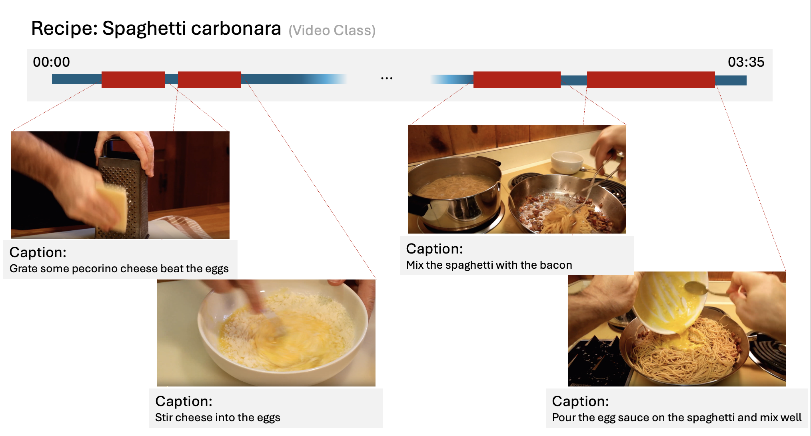

# LongVideo-Dataset

This repository provides an **overview of the long video datasets** used in our project.  
The goal is not to provide download or implementation details, but to **clarify the structure, properties, and annotations** of each dataset

---

## 1. LVU-movieclips
- **Domain & Task**: Movie clips from diverse genres; designed for *Video QA, Emotion Recognition, and Scene Understanding*.  
- **Scale & Length**: ~62,000 clips from 1,000+ movies; average clip ~2 minutes.  
- **Annotation Granularity**:  
  - Scene-level labels (emotion, action, objects).  
  - Question-Answer (QA) pairs for reasoning.  
- **Modalities**: Video, Audio, Text (subtitles, QA).  
- **Key Challenges**: Diverse content across genres; multi-event structure within each clip.  
- **Visualization Ideas**:  
  - Genre distribution pie chart.  
  - Example clip timeline with event/QA annotation.

---

## 2. ActivityNet
- **Domain & Task**: Untrimmed web videos; widely used for *Temporal Action Localization* and *Activity Recognition*.  
- **Scale & Length**: ~20,000 videos (~648 hours total); average length ~2 minutes (30s ~ 10min).  
- **Annotation Granularity**: Temporal segments with activity labels (`start_time`, `end_time`, `label`).  
- **Modalities**: Video, Audio.  
- **Key Challenges**: Actions appear sparsely within long videos; significant background content.  
- **Visualization Ideas**:  
  - Histogram of video length distribution.  
  - Example timeline with detected actions vs background.

---

## 3. YouCook2

### Split statistics
| split      | n_videos | total_minutes | avg_minutes_per_video |
|:-----------|---------:|--------------:|----------------------:|
| testing    |      190 |       1005.76 |                  5.29 |
| training   |     1161 |       6139.07 |                  5.29 |
| validation |      410 |       2132.85 |                  5.20 |
| **total**  |   **1761** |     **9277.67** |               **5.27** |

- **Domain & Task**: Cooking instructional videos; mainly used for *Video Captioning* and *Instructional Understanding*.  
- **Duration, FPS, Resolutions**:

  

- **Annotation Granularity**: Segment-level cooking steps with captions.  

  

- **Modalities**: Video, Audio, Text (captions).  
- **Key Challenges**: Long dependencies between sequential steps; fine-grained reasoning required.  
---

## 4. FineVideo
- **Domain & Task**: Multi-domain (sports, instructional, daily activities); designed for *Fine-grained and Hierarchical Video Understanding*.  
- **Scale & Length**: ~1,500 videos (~400 hours); average ~15 minutes.  
- **Annotation Granularity**: Hierarchical labels — coarse actions → fine-grained sub-actions.  
- **Modalities**: Video, Audio.  
- **Key Challenges**: Very long videos (10min+); hierarchical reasoning required across levels.  
- **Visualization Ideas**:  
  - Tree diagram showing hierarchical labels.  
  - Timeline plot highlighting coarse vs fine-grained events.

---

## 5. COIN
- **Domain & Task**: Instructional videos across 180 daily tasks (e.g., DIY, repair, cooking); used for *Step Segmentation* and *Instructional Representation Learning*.  
- **Scale & Length**: ~11,827 videos (~476 hours); average ~2.5 minutes.  
- **Annotation Granularity**:  
  - Task-level → step-level segmentation.  
  - Step-by-step textual descriptions.  
- **Modalities**: Video, Audio, Text (step descriptions).  
- **Key Challenges**: Multi-step reasoning; alignment between task and step structure.  
- **Visualization Ideas**:  
  - Histogram of steps per task.  
  - Example video timeline with step segmentation.

---

## 6. BREAKFAST
- **Domain & Task**: Daily cooking and morning activity videos; used for *Fine-grained Action Segmentation* and *Sequential Modeling*.  
- **Scale & Length**: ~1,712 videos (~77 hours); average 2–5 minutes.  
- **Annotation Granularity**: Frame-level labels for atomic actions; ordered activity sequences (e.g., “take cup → pour coffee → stir”).  
- **Modalities**: Video, Audio.  
- **Key Challenges**: Fine-grained sequential dependencies; high intra-class variation.  
- **Visualization Ideas**:  
  - Class frequency bar chart (e.g., “take cup” vs “pour milk”).  
  - Example annotated frame sequence illustrating step order.

---

# 📊 Comparison Table

| Dataset        | Domain         | #Videos | Hours | Avg Length | Annotation Level        | Modalities       |
|----------------|----------------|---------|-------|------------|-------------------------|-----------------|
| LVU-movieclips | Movies         | 62k     | -     | ~2 min     | Scene + QA              | V, A, T         |
| ActivityNet    | Web videos     | 20k     | 648h  | ~2 min     | Temporal action         | V, A            |
| YouCook2       | Cooking        | 1.7k      | 155h  | 5.3 min   | Segment + Captions      | V, A, T         |
| FineVideo      | Multi-domain   | 1.5k    | 400h  | 15 min     | Hierarchical labels     | V, A            |
| COIN           | Instructional  | 11.8k   | 476h  | 2.5 min    | Task → Step segmentation| V, A, T         |
| BREAKFAST      | Daily activity | 1.7k    | 77h   | 2–5 min    | Frame-level + Sequence  | V, A            |

---
